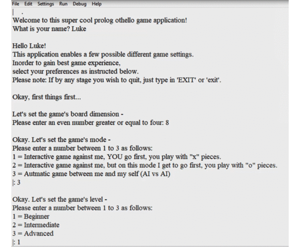

# Prolog-Othello-Game 

## Description 
[Othello Game](https://en.wikipedia.org/wiki/Reversi#Othello) :chess_pawn: Implemented with [Alpha-Beta Algorithm](https://en.wikipedia.org/wiki/Alpha%E2%80%93beta_pruning) in [SWI-Prolog's](https://www.swi-prolog.org/) Logic Programming Language. 
The AI engine alpha-beta algorithm is based on heuristics such as capturing cornes & number of overall captured pieces. 

## Features
### Game Mode 
* Play Against Computer (Human vs AI) :technologist:
* Watch Computer vs Computer (AI vs AI) :desktop_computer: :computer:

### Difficulty level 
This is relevant of course only when playing against the computer (and not when watching computer against computer). 
The difficulty level is influenced by means such as the depth level of the search algorithm & the heuristics taken into account. 

## Documentation 
See [Documention](Documentation.pdf) for ruther details. 

## Sample Screenshots 

